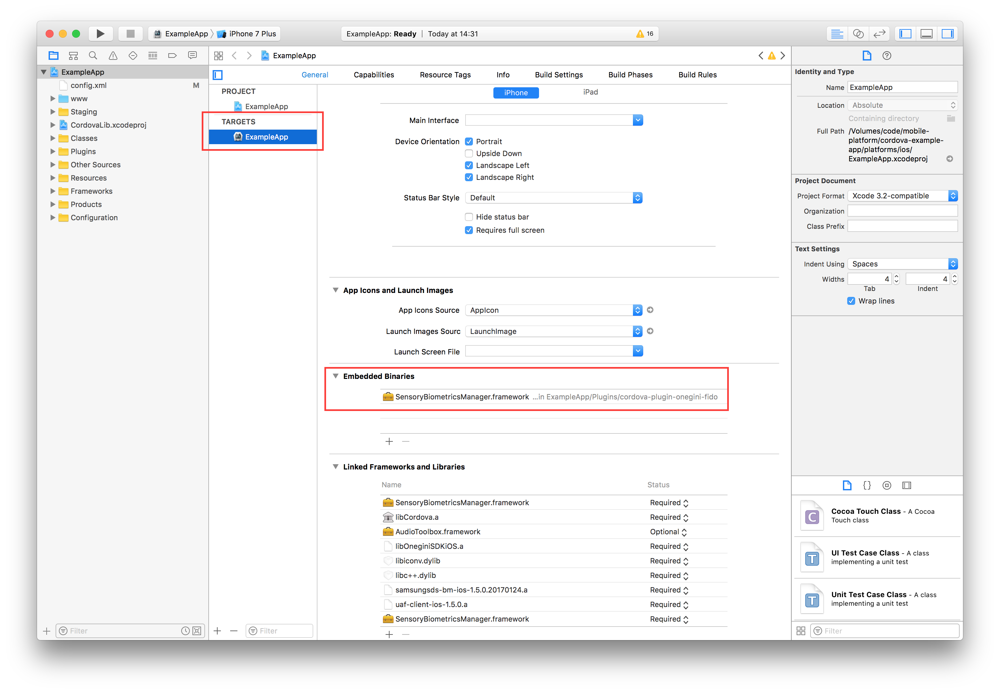

# User authentication with fingerprint

<!-- toc -->

## Introduction

The Onegini Cordova plugin allows you to authenticate users with [FIDO UAF authenticators](https://fidoalliance.org/), if one is available on the device and you have performed the steps 
described in this topic guide. FIDO authenticators can be used for both regular authentication as well as mobile authentication.

FIDO authentication is not a standard feature of the Onegini Mobile Security Platform. It is licensed separately since it depends on other 
third-party software.

## Enabling FIDO authentication

In order to enable FIDO authentication for your application you must add an additional Cordova plugin to your application project.

```bash
cordova plugin add https://github.com/Onegini/cordova-plugin-onegini-fido
```

> *INFO*: It is required that you add the FIDO plugin before you add the normal Onegini Cordova plugin (cordova-plugin-onegini).
> Due to the way dependencies are resolved, FIDO authentication will not work if the fido plugin is added _after_ cordova-plugin-onegini.
> An example:
>```bash
>cordova plugin add https://github.com/Onegini/cordova-plugin-onegini-fido https://github.com/Onegini/cordova-plugin-onegini
>```

### Setting up iOS

Because Cordova does not support adding frameworks as embedded binaries, you must manually modify the Xcode project before you are able to build & run your 
application.

The `SensoryBiometricsManager.framework` must be added as an embedded binary to your application target.
Add the `SensoryBiometricsManager.framework` to the 'Embedded Binaries' by clicking the + sign and selecting `SensoryBiometricsManager.framework`.
The result should look like the image below:


## Registering a FIDO authenticator

In order to register a FIDO authenticator for a user, the Onegini Cordova plugin provides the [`onegini.user.authenticators.registerNew`](../reference/user/authenticators.md#oneginiuserauthenticatorsregisternew). 
To register a FIDO authenticator, you will need to implement the `onSuccess` and `onError` events. As part of the 
FIDO authenticator registration flow the user is asked to perform a certain action. This could for instance be to place their face in front of the camera 
(for face authentication) or place their finger on the fingerprint scanner (for FIDO fingerprint authentication).
FIDO Authenticators that requires such actions come embedded with their own UI.

**Example code for registering a FIDO authenticator:**

```js

// Lookup one of the FIDO authenticators. There could be multiple FIDO authenticators, but for this example we simply use the first FIDO authenticator we find.
onegini.user.authenticators.getNotRegistered({ profileId: 'profileId' })
  .then((authenticators) => {
    let fidoAuthenticator = authenticators.find(authenticator => authenticator.authenticatorType === "FIDO");
    onegini.user.authenticators.registerNew(fidoAuthenticator)
      .onSuccess(() => {
        alert('Success!')
      })
      .onError(() => {
        alert("Error!\n\n" + err.description);
      });
  });
```

FIDO authentication may not be available on every device. In this case, or if the authenticator has already been registered, the above method will return an error. 
Please verify the specifications of the FIDO authenticators to see which authenticators should be working on the device that you are using. FIDO will not work 
on a simulator.

To request a list of available authenticators that have not yet been registered, the plugin exposes the [`onegini.user.authenticators.getNotRegistered`](../reference/user/authenticators.md#oneginiuserauthenticatorsgetnotregistered)
function, which takes the `profileId` of the desired user as argument. If the device does not meet the FIDO requirements, the FIDO authenticator will not be 
present in the returned array of of authenticators.

Note that registering a new authenticator does not set it as the preferred authenticator for the user, which is PIN by default. 
To change this, [`onegini.user.authenticators.setPreferred`](../reference/user/authenticators#oneginiuserauthenticatorssetpreferred) can be used.